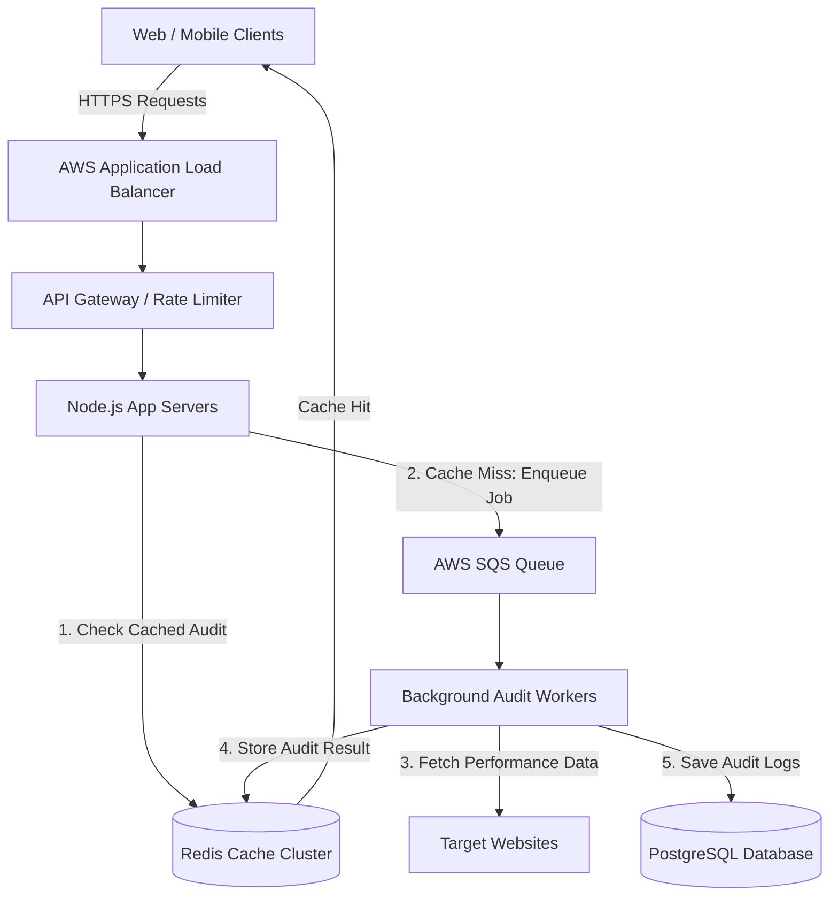

# Page Pulse - System Architecture & Scaling Plan

This document explains how **Page Pulse** handles 10,000+ daily URL audits and traffic spikes of 500 concurrent requests without crashing or dropping connections.

---

## 1. System Architecture & Component Design

Below is the component layout and data flow for handling high-volume traffic.

### Component Roles & State Management
- **Load Balancer (AWS ALB)**: Spreads incoming HTTPS traffic evenly across server nodes and manages SSL certificates.
- **API Gateway**: Blocks bad IPs, stops DDoS attacks, and enforces rate limits before requests hit app servers.
- **Stateless App Servers**: Fast Node.js Express servers. If a URL audit is already in Redis cache, it returns the result immediately. If not, it pushes a job to SQS.
- **Message Queue (AWS SQS)**: Buffers traffic bursts (e.g. 500 requests at the exact same second) so servers do not run out of memory or sockets.
- **Background Workers**: Independent Node.js processes that pull jobs from SQS, fetch target websites, calculate load time, and save the output.
- **Redis Cluster**: Stores active rate limits and caches audit results for 60-300 seconds.
- **PostgreSQL**: Stores long-term audit history and analytics.

---

## 2. Technology Choice & Trade-offs (TDR)

| System Layer | Selected Tech | Reason for Choice | Rejected Alternative | Reason for Rejection |
| :--- | :--- | :--- | :--- | :--- |
| **API Runtime** | **Node.js / Express** | Fast non-blocking I/O event loop; easily handles thousands of concurrent requests. | **Python (Flask)** | Synchronous worker model requires excessive memory and CPU under 500 concurrent requests. |
| **Cache Storage** | **Redis Cluster** | In-memory key-value cache with sub-millisecond lookups and built-in expiration (TTL). | **Local In-Memory Cache** | Local server memory is not shared across multiple app servers, causing duplicate fetches. |
| **Job Queue** | **AWS SQS** | Decouples HTTP requests from website scraping; buffers large traffic spikes smoothly. | **Direct HTTP Axios Calls** | Making 500 outbound calls simultaneously crashes the Node event loop and socket pool. |
| **Database** | **PostgreSQL** | Reliable relational database with JSONB support for structured metrics and history logs. | **MongoDB** | Lacks strong ACID transactions needed for strict client rate-limiting and quota tracking. |

---

## 3. Top 3 Failure Modes & Mitigations

### 1. Target Website IP Blocking / HTTP 429 Errors
- **Problem**: Fetching the same destination website repeatedly triggers Cloudflare or WAF bot protection.
- **Fix**: Route worker outbound calls through rotating proxy IPs, set a max cap of 2 active requests per target domain, and use exponential backoff on 429 errors.

### 2. Queue Backlog During Sudden Traffic Spikes
- **Problem**: 500 requests arrive at once, causing the queue to build up and delaying response times.
- **Fix**: Use Kubernetes/KEDA autoscaling to automatically launch extra worker pods whenever queue depth exceeds 50 messages per worker.

### 3. Redis Cache Stampede
- **Problem**: A popular cached URL expires, and 100 users request the exact same URL at the exact same second, bypassing cache and overloading target servers.
- **Fix**: Use a Redis distributed lock (Redlock) so only the first worker fetches fresh data, while the other 99 requests wait for that single result to complete.

---

## 4. Observability & Rollback Strategy

### Monitoring & Thresholds
- **P99 Latency**: Alert if 99% of requests take > 2 seconds for 3 consecutive minutes.
- **Error Rate**: Alert if HTTP 5xx errors exceed 1% of total traffic.
- **Queue Depth**: Alert if SQS queue has > 500 pending jobs.

### Automated Deployment Rollback
1. **Canary Deployment**: Route 5% of live traffic to the new build.
2. **Health Check Probes**: Run automated probes to `/health` and sample `/api/audit` calls every 10 seconds.
3. **Instant Revert**: If error rate exceeds 0.5% or latency increases by 25% over 5 minutes, traffic automatically shifts back to the previous stable build.
